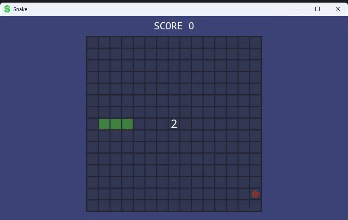

# Simple Snake Game made with C# .NET WPF framework. 



*Figure 1 - The Snake App Example*

I made a simple snake app in C# using .NET's WPF framework. This application utilises assets to create the grids and the snake. 

```c#
 private void DrawGrid()
 {
     for (int row = 0; row < _rows; row++)
     {
         for (int column = 0; column < _columns; column++)
         {
             Grid gridValue = gameState._Grid[row, column];
             _images[row, column].Source = GridToImage[gridValue];
         }
     }
 }
```
*Figure 2 - Draw Grid Loop Method*

The code block above is a method that contains 2 loops, both for the rows and columns of the grid. It then draws the grid onto the WPF application window. 

```c#
 private Image[,] GridInitialiser()
 {
     Image[,] images = new Image[_rows, _columns];
     GameGrid.Rows = _rows;
     GameGrid.Columns = _columns;

     for (int rows = 0; rows < _rows; rows++)
     {
         for (int columns = 0; columns < _columns; columns++)
         {
             Image image = new Image
             {
                 Source = Assets.Empty
             };

             images[rows, columns] = image;
             GameGrid.Children.Add(image);
         }
     }

     return images;
 }
```
*Figure 3 - Grid Initialiser Method*

The code block initialises the grid by grabbing the assets from the assets folder, and fills them out with a loop to create a grid. 
